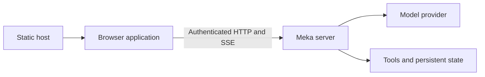

# Architecture

mekaweb is a static React/TypeScript/Vite application. Meka owns execution and persistent server state; the browser owns connections, drafts, presentation, and live monitoring. See [API support](api-coverage.md) for the supported contract.

## Application boundaries

| Module             | Responsibility                                                        |
| ------------------ | --------------------------------------------------------------------- |
| `src/api/`         | Authenticated transport, Problem Details, and generated REST types    |
| `src/connections/` | Browser storage, credentials, connection lifetime, and query access   |
| `src/session/`     | Event feeds, turn state, approvals, submissions, recovery, and drafts |
| `src/features/`    | Screens and feature-specific components                               |
| `src/components/`  | Shared controls, layout, and rich-content rendering                   |

TanStack hash routing supports static hosting and subpaths without server rewrites. TanStack Query caches fetched resources by connection and credential authority. Components issue intents; transport, storage, and session coordination remain independent of page lifetime.

## Credentials and browser storage

The API client preserves reverse-proxy paths, rejects credentials embedded in URLs, and sends bearer tokens only to the selected endpoint. Authenticated requests reject redirects. Images and exports use the API client and managed object URLs. SSE uses fetch so requests can carry the Authorization header.

| Data                                                       | Storage                                                                      |
| ---------------------------------------------------------- | ---------------------------------------------------------------------------- |
| Sessions, resources, permissions, tasks, schedules         | Meka's store                                                                 |
| Connection metadata, theme, panel preferences              | Versioned localStorage                                                       |
| API tokens                                                 | localStorage by default for new connections; sessionStorage when selected    |
| Text drafts                                                | Connection/session-scoped localStorage, up to 20 drafts of 50,000 characters |
| Attachments, sending options, live previews, query results | Connection-scoped memory                                                     |

Endpoint changes create a new connection identity and remove the replaced connection's credentials and drafts. Credential replacement/removal disposes old requests, feeds, and authenticated caches across tabs. Cross-tab notifications contain invalidation identifiers, not tokens. Changing the selected connection does not navigate another tab.

Browser storage is not encrypted by the application. Forgetting a token removes local access but does not revoke it on the server. Scopes control visible actions; the server remains authoritative. A 401 retires the connection, while a 403 is shown as an actionable refusal.

## Session coordination and recovery

The session controller monitors the selected session and active work followed by the tab. Approval cards live outside page components so navigation does not abandon them. Idle, unselected feeds are released; disconnecting disposes all feeds. The last attending reader leaving can cancel a pending approval, but accepted inbox work and blocking turns are not tied to a browser request's lifetime.

Text uses inbox `steer`; queueing uses `followup`; interruption uses `interrupt`. Stop sends the observed turn id to `/cancel`. Accepted submission, provider delivery, and turn completion are separate states.

Images, skill activation, and explicit direct-turn retention use `/turn` with `stream: false`, while an attending feed supplies live events. These requests start only while idle. A racing 409 retains the draft. Direct-turn idempotency does not survive a server restart.

Inbox retries preserve their original body and idempotency key. Management mutations are never retried automatically. Lost responses, HTTP timeouts, and server/gateway errors have uncertain outcomes and are reconciled through reads where possible. Read retries and stream reconnects honor server retry timing.

Pending settings and deletion remain controller state through navigation and feed replacement. New sends wait for acknowledgment. Retired controllers cannot reopen feeds, and stale completions cannot publish into replacement entries. Session dialogs close when navigation changes their target. Acknowledgments clear submitted drafts while preserving subsequent edits; conflicting edits from other tabs are surfaced.

## Saved history and live output

`/messages` is the current model context, not an immutable transcript. Compaction and rewind can replace it. Live turn UUIDs differ from saved turn indexes; the API provides neither stable message ids nor an atomic snapshot/feed cursor. Saved and live messages must not be merged by equal text or guessed identifiers.

The controller establishes the feed before starting work and tracks explicit replay ids and history revisions. Transient command-output and sub-agent activity events do not advance the replay cursor. Terminal events reconcile temporary previews with saved state; turn generations prevent an older fetch from clearing newer output.

Pagination preserves loaded history until its revision changes. Replay gaps, server resets, and ambiguous joins are labeled incomplete. Tool output and sub-agent activity are live previews, not reconstructed transcript entries. Compaction summaries use API metadata and link users to transcript export for earlier history.

## Rendering

Model and tool content is untrusted. Markdown raw HTML is disabled. Code highlighting loads locally on demand, math uses KaTeX without trusted commands, and Mermaid previews reject configuration directives and external resources. Diagrams are sanitized and displayed as static images. External Markdown images become links; only endpoint blobs receive API credentials.

Wide tables, code, formulas, and diagrams scroll within the content column. Dialogs and menus use Radix focus handling. Resource editors preserve raw bodies and distinguish omitted fields from intentional empty values; background refresh does not overwrite an editor's draft.

REST types are generated from the [pinned OpenAPI schema](api/README.md). SSE payload types and validation are maintained separately because the schema's streaming response declaration is not a complete event contract. The client does not depend on meka's private database schema or replay implementation.
