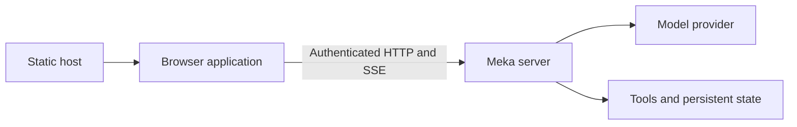

# Architecture

mekaweb is a static React/TypeScript/Vite application. Meka owns execution and persistent server state; the browser owns connections, drafts, presentation, and live monitoring. See [API support](api-coverage.md) for the supported contract.

## Application boundaries

| Module             | Responsibility                                                        |
| ------------------ | --------------------------------------------------------------------- |
| `src/api/`         | Authenticated transport, Problem Details, and generated REST types    |
| `src/connections/` | Browser storage, credentials, connection lifetime, and query access   |
| `src/session/`     | Event feeds, turn state, approvals, submissions, recovery, and drafts |
| `src/features/`    | Screens and feature-specific components                               |
| `src/components/`  | Shared controls, layout, and rich-content rendering                   |

TanStack hash routing supports static hosting and subpaths without server rewrites. TanStack Query caches fetched resources by connection and credential authority. Components issue intents; transport, storage, and session coordination remain independent of page lifetime.

## Credentials and browser storage

The API client preserves reverse-proxy paths, rejects credentials embedded in URLs, and sends bearer tokens only to the selected endpoint. Authenticated requests reject redirects. Images and exports use the API client and managed object URLs. SSE uses fetch so requests can carry the Authorization header.

| Data                                                       | Storage                                                                      |
| ---------------------------------------------------------- | ---------------------------------------------------------------------------- |
| Sessions, resources, permissions, tasks, schedules         | Meka's store                                                                 |
| Connection metadata, theme, conversation font size, panels | Versioned localStorage                                                       |
| API tokens                                                 | localStorage by default for new connections; sessionStorage when selected    |
| Text drafts                                                | Connection/session-scoped localStorage, up to 20 drafts of 50,000 characters |
| Attachments, sending options, live previews, query results | Connection-scoped memory                                                     |

Endpoint changes create a new connection identity and remove the replaced connection's credentials and drafts. Credential replacement/removal disposes old requests, feeds, and authenticated caches across tabs. Cross-tab notifications contain invalidation identifiers, not tokens. Changing the selected connection does not navigate another tab.

Connection discovery has a 10-second deadline covering retries and the response body. It can be canceled or superseded by another saved connection. Failed or canceled discovery preserves saved credentials and any already-connected endpoint; late responses cannot replace a newer connection. This deadline does not apply to running turns or event streams.

Transport failures on the active API instance are typed connection errors and have one owner: the connection runtime. A global banner replaces duplicate local notices for those errors; discovery attempts and HTTP/protocol errors keep local feedback, and uncertain mutations keep their recovery warnings. The runtime probes liveness after five seconds, with a five-second deadline, and accepts recovery only from requests begun after the latest failure. Recovery invalidates reads and resumes failed feeds within the existing controller; it never repeats a mutation or replaces credentials. Disconnecting or switching authority aborts recovery checks. The banner is a live region above dialogs, and its measured height reserves space for the workspace and modal controls.

Browser storage is not encrypted by the application. Forgetting a token removes local access but does not revoke it on the server. Scopes control visible actions; the server remains authoritative. A 401 retires the connection, while a 403 is shown as an actionable refusal.

## Session coordination and recovery

The session controller monitors the selected session and active work followed by the tab. Approval cards live outside page components so navigation does not abandon them. Idle, unselected feeds are released; disconnecting disposes all feeds and POST readers. Streaming turns can be canceled by meka after its reattachment grace expires without any readers. Accepted inbox work runs independently of a browser request's lifetime.

The controller routes idle messages through `POST /turn` with `stream: true`. Once that response announces its turn ID, submission is acknowledged and the composer is free for more input. While work is running, text uses inbox `steer`; queueing uses `followup`; interruption uses `interrupt`. The selected inbox mode applies only while busy. Stop sends an observed turn ID to `/cancel`.

The POST stream establishes admission and its own submission's outcome. The attending session feed is the sole renderer of content, tools, and approvals, including externally started turns, so the two streams cannot duplicate displayed events. Completion on either stream reconciles saved history; delayed replay cannot reopen a completed turn or end a newer one. If replay misses a start event, subsequent activity can establish its explicit turn ID for cancellation while the preview stays labeled incomplete. POST readers belong to the controller and survive page navigation or feed reconnection. A dropped POST after admission is recovered through the feed and session/history reads, never a repeated POST.

Images, skill activation, and explicit direct-turn retention require an idle session. A definitive `409 turn-in-flight` can route ordinary text through the selected inbox mode; direct-only inputs retain their draft. Other conflicts and ambiguous network failures never trigger that fallback. Streaming turns ignore idempotency keys; recovery does not rely on a direct-turn retry cache.

Inbox retries preserve their original body and idempotency key. Management mutations are never retried automatically. Lost responses, HTTP timeouts, and server/gateway errors have uncertain outcomes and are reconciled through reads where possible. Read retries and stream reconnects honor server retry timing.

Pending settings and deletion remain controller state through navigation and feed replacement. New sends wait for acknowledgment. Retired controllers cannot reopen feeds, and stale completions cannot publish into replacement entries. Session dialogs close when navigation changes their target. Acknowledgments clear submitted drafts while preserving subsequent edits; conflicting edits from other tabs are surfaced.

## Session organization

Titles and pins belong to meka’s store. Metadata edits use the session controller’s serialized PATCH path, update selected-session metadata, and invalidate list and search queries. Editing a session from the list does not open a feed or revive an agent. Uncertain mutations refresh visible state without automatic retries.

The selected session's metadata participates in query invalidation and polls while its screen is open. These reads update the controller's session record without replacing conversation history or live turn state. Reads overtaken by a settings acknowledgment or snapshot refresh cannot restore older metadata. The first provider event invalidates metadata again, since turn admission can precede the first user message being saved. Inline title edits keep their own draft through these updates.

The sidebar preserves the server’s pin/recency order and passes pagination cursors through unchanged. Search is debounced, connection-scoped, and abortable; it uses the server’s conversation index, relevance order, and plain-text excerpts. Search has no cursor and caps results at 100. Controls for titles, pins, and search require a discovered version of at least 0.64.0, since older servers may ignore unknown PATCH fields.

## Saved history and live output

`/messages` is the current model context, not an immutable transcript. Compaction and rewind can replace it. Live turn UUIDs differ from saved turn indexes; the API provides neither stable message ids nor an atomic snapshot/feed cursor. Saved and live messages must not be merged by equal text or guessed identifiers.

The controller establishes the feed before starting work and tracks explicit replay ids and history revisions. Transient command-output and sub-agent activity events do not advance the replay cursor. Terminal events reconcile temporary previews with saved state; turn generations prevent an older fetch from clearing newer output.

Pagination preserves loaded history until its revision changes. Replay gaps, server resets, and ambiguous joins are labeled incomplete. Tool output and sub-agent activity are live previews, not reconstructed transcript entries. Compaction summaries use API metadata and link users to transcript export for earlier history.

New sessions enable reasoning streams by default; available `thinking.delta` events render as they arrive. Capabilities are fixed at session creation, so existing and imported sessions retain their own setting. Injected `turn_context` blocks are hidden unless **Show context added by meka** is enabled in **Settings → Diagnostics**. This browser-local display preference does not alter model context, saved history, or exports.

Saved tool calls and results share a disclosure, paired by explicit tool-call IDs within an assistant round. Pairing is limited to the loaded snapshot and stops at compaction boundaries. Unmatched or ambiguous results stay visible separately; loading earlier messages can supply a missing call. This presentation does not change the saved messages or merge saved history with live output.

Tool headings use the server's `display_summary` from live execution events. History lacks this field and tool schemas, so `src/session/tool-summary.ts` follows meka's built-in primary-argument mappings, including supported older names. Unknown tools without a server summary remain bare, as in meka's history renderer. Header previews are bounded, single-line text; expanded arguments retain their original values.

Consecutive assistant messages share an Agent heading. Changes in virtual turn indexes remain boundaries unless the intervening rows consist solely of matched tool results, which meka encodes as user-role messages. User input, compaction markers, and unmatched results always keep their boundaries.

Local submissions appear immediately as You previews, interleaved with live output. Routine admitted direct turns need no acceptance banner or queue. Snapshot replacement waits while admission is unknown. A history read begun after confirmed input persistence or completion replaces the preview; a pending-inbox read also recovers missed delivery events without assuming that absence proves delivery. Pending inbox items appear as chat messages with an inline Withdraw action; delivery events refresh that state. Queued items remain previews, and uncertain submissions retain their recovery controls inside the corresponding message. Preview replacement never compares message text. The inbox API exposes metadata without bodies: after a reload, unmatched pending items have an explicit text-unavailable placeholder. Local text is associated only by item ID. Pending requests without an item ID are resolved before showing unmatched placeholders, so an early inbox read cannot duplicate their messages. Composer errors and draft-conflict choices render in the conversation rather than in panels around the input.

Server notices and turn failures appear as inline messages with their severity. The controller keeps the latest 20 notices for each session on the tab's connection; they are live diagnostics, not additions to the saved transcript. Terminal diagnostics can arrive through either stream and are deduplicated by event type and turn ID. Routine client cancellation produces no extra notice, and tool errors remain in their tool cards. A turn failure shown in the conversation does not repeat in the composer's submission problems.

## Rendering

Model and tool content is untrusted. Markdown raw HTML is disabled. Code highlighting loads locally on demand, math uses KaTeX without trusted commands, and Mermaid previews reject configuration directives and external resources. Diagrams are sanitized and displayed as static images. External Markdown images become links; only endpoint blobs receive API credentials. Image reads participate in connection recovery. Successfully loaded content hashes remain cached while displayed, with their bytes and object URLs released when no longer in use.

Wide tables, code, formulas, and diagrams scroll within the content column. Dialogs and menus use Radix focus handling. Resource editors preserve raw bodies and distinguish omitted fields from intentional empty values; background refresh does not overwrite an editor's draft.

REST types are generated from the [pinned OpenAPI schema](api/README.md). SSE payload types and validation are maintained separately because the schema's streaming response declaration is not a complete event contract. The client does not depend on meka's private database schema or replay implementation.
